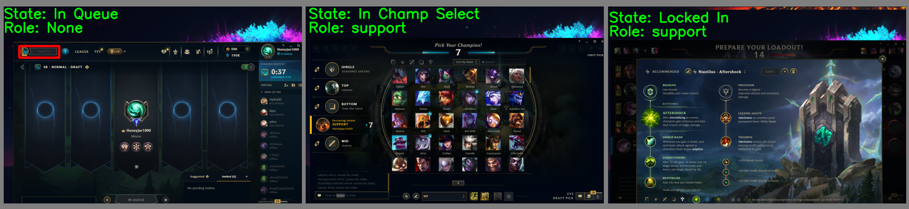
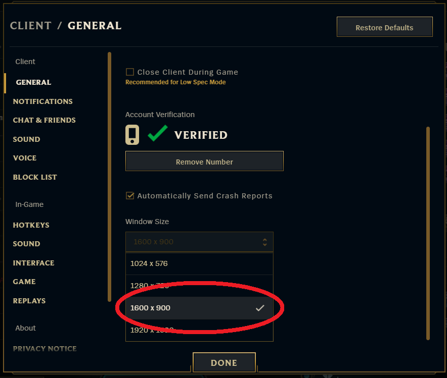

# Automatic Queue Bot for League of Legends

<p align="center">
  
</p>

 Script to automatically except queue pops, and lock in champions all while afk.
 Simply enter a lobby, search for a match, and leave your computer while the bot locks in your selected champion and runes.

 NOTE: This program uses computer vision and will only work if the __client is window size 1600 x 900__

<p align="center">
  
</p> 

 ## Installation

Follow these steps to get the project up and running on your local machine:

### 1. Download the Repository as a ZIP
- Go to the [GitHub repository page](https://github.com/yourusername/your-repo-name).
- Click on the **"Code"** button and select **"Download ZIP"**.
- Extract the downloaded ZIP file to a folder on your local machine.

### 2. Create a Virtual Environment
To ensure that the project dependencies do not interfere with other projects, it's recommended to use a virtual environment.

- Open your terminal and navigate to the project directory:

  ```bash
  cd path/to/your-extracted-repo
  ```
  
- Open your terminal and navigate to the project directory:

  ```bash
  python -m venv venv
  ```

- Create a virtual environment by running the following command:

  ```bash
  python -m venv venv
  ```
  
### 3. Activate the Virtual Environment

- Windows:
  
 ```bash
 python -m venv venv
 ```

- macOS/Linux:
  
 ```bash
 source venv/bin/activate
 ```

Once activated, your terminal prompt should show (venv) at the beginning, indicating that the virtual environment is active.

### 4. Install the Required Dependencies

Install all the necessary libraries and dependencies specified in the requirements.txt file by running:

```bash
pip install -r requirements.txt
```


## Instructions

Open the config.yaml file and enter champion preferences for each role.

- Run the main.py script by using the following command (make sure the environment is activated):

```bash
python main.py
```

- The program can be quit at any time by holding Q or ESC. That's it!
- The program will lock in your selected champions (picking a random champion if impossible) while you AFK!
- A window will pop up of your main screen, note that the league client must be one this screen for the program to work.

## To Come

- Ability to ban champion.
- More champion preferences.
- Specify runes.
